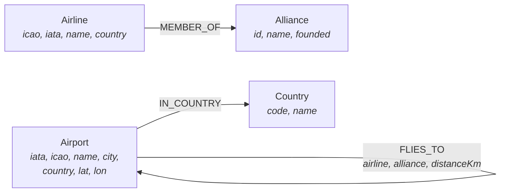
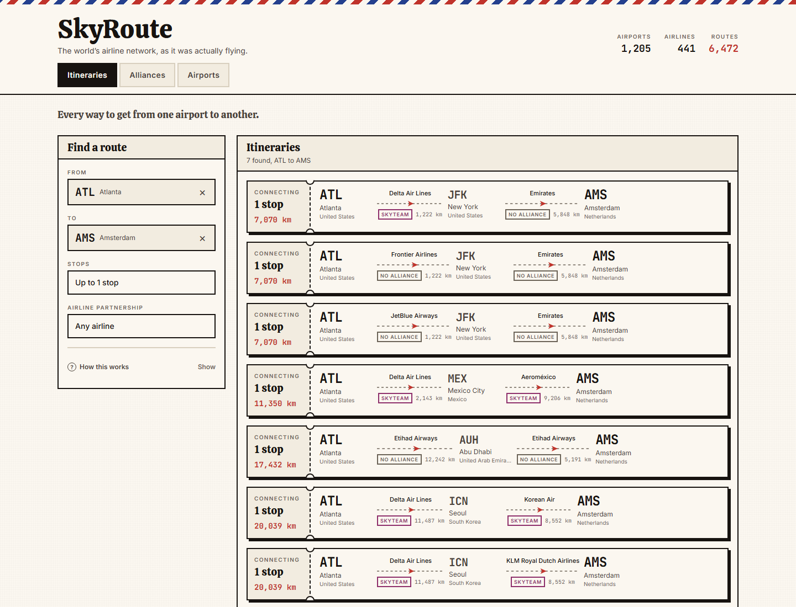
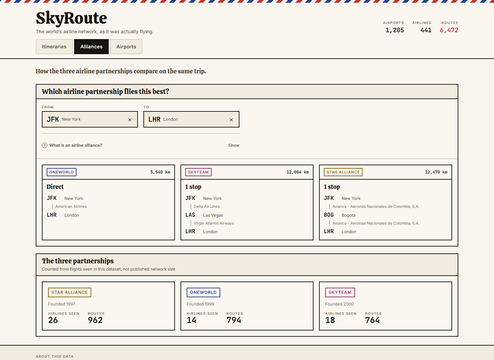
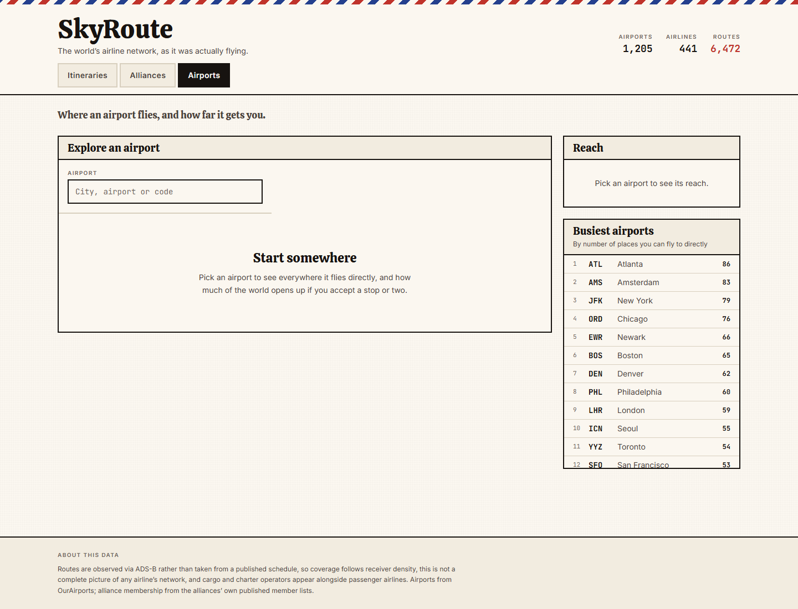

# SkyRoute

**The airline route network as a graph.** Which airlines connect two cities, what
you give up by staying inside one alliance, and how much of the world opens up when
you accept one more connection.

Built on [CognoDB](https://console.cognodb.com) using openCypher over Bolt, with a
FastAPI backend and a React frontend served from the same process.

- **Live demo:** _<add your hosted URL here>_
- **Screen recording:** _<add your recording link here>_

---

## Table of contents

- [The use case](#the-use-case)
- [Why a graph database?](#why-a-graph-database)
- [Data model](#data-model)
- [Where the data comes from](#where-the-data-comes-from)
- [Running it](#running-it)
- [The main queries](#the-main-queries)
- [Project structure](#project-structure)
- [Engineering notes](#engineering-notes)
- [Screenshots](#screenshots)

---

## The use case

A route network is not a list of flights. It is a graph whose edges happen to be
flights, and almost every interesting question about it is a question about paths:

| View | Question it answers |
|---|---|
| **Itineraries** | "How do I get from Manila to Reykjavik, and what are all the ways?" |
| **Alliances** | "If I want to keep my status and stay on one alliance, what does that cost me in stops and distance?" |
| **Airports** | "What can I reach directly from here, and how many countries open up if I accept one connection?" |

The alliance question is the one that motivated the project. Frequent flyers pick
itineraries to stay inside a single alliance, because that is what earns and
recognises status. That is not a filter on a flight. It is a constraint that must
hold on **every leg of a journey of unknown length** - which is exactly the kind of
thing a graph query expresses in a line and a relational query does not.

---

## Why a graph database?

Being straight about this, because part of the application does not need one.

### The part that does not

"Which airlines fly out of MNL" and "list the busiest airports" are a join and a
`GROUP BY`. Postgres would serve those perfectly well, and I would not reach for a
graph database to build them alone.

### The part that does

Itinerary search. Ask for every way to get from A to B in at most two flights,
where every leg is on the same alliance, ranked by total distance flown. In Cypher
that is one pattern plus one predicate:

```cypher
MATCH route = (o:Airport {iata: $origin})-[:FLIES_TO*1..2]->(d:Airport {iata: $destination})
WHERE ALL(r IN relationships(route) WHERE r.alliance = $alliance)
```

Four things make that hard relationally:

**1. The path length is not known when you write the query.** An itinerary might be
one flight or two. SQL needs a recursive CTE that self-joins the route table once
per level, with the depth bound living inside the recursion rather than in the
pattern.

**2. The constraint is on the path, not on a row.** "Every leg is on the same
alliance" cannot be checked one flight at a time. In the recursive form you have to
thread the alliance through every level as a carried column and compare against it
on each join. In Cypher, `relationships(route)` is a list and `ALL` reads like the
sentence you would say out loud.

**3. The ranking is an aggregation over the whole path.** Total distance is a fold
over the legs. The recursive version accumulates it as another carried column.

**4. Cycles have to be excluded by hand.** An itinerary must not visit the same
airport twice. Cypher hands you `nodes(route)` as a list to test. SQL needs a
visited-set array you append to and check on every level.

The alliance comparison pushes this one step further. It asks for the best
itinerary **per alliance** in a single query, which means grouping paths by a
property that must be uniform across the whole path:

```cypher
WITH stops, legs, [r IN legs | r.alliance] AS alliances
WHERE alliances[0] <> 'none'
  AND size([x IN alliances WHERE x = alliances[0]]) = size(alliances)
```

Then there is `shortestPath`, which answers "fewest connections between these two
airports" in one line and has no concise SQL equivalent.

### And the shape of the domain

The model reads the way the domain works. An airport is a place, an airline is an
operator, an alliance is a group, and a flight is a relationship between two places
with an operator attached. Nothing has to be flattened into a join table that does
not correspond to anything real.

### The honest caveat

At this dataset's size a well-indexed relational schema would also be fast. The
argument is **expressiveness and modelling fit**, not raw throughput. What a graph
buys here is that the hard query is short enough to read, and short enough to be
confident is correct.

---

## Data model



### Nodes

| Label | What it is | Key properties |
|---|---|---|
| `Airport` | One airport with an IATA code | `iata`, `icao`, `name`, `city`, `country`, `lat`, `lon`, `destinations` |
| `Airline` | One operator | `icao`, `iata`, `name`, `country`, `alliance`, `routeCount` |
| `Alliance` | Star Alliance, oneworld or SkyTeam | `id`, `name`, `founded` |
| `Country` | For grouping reach by country | `code`, `name` |

### Relationships

| Type | Direction | Properties | Meaning |
|---|---|---|---|
| `FLIES_TO` | `Airport → Airport` | `airline`, `alliance`, `distanceKm`, `observations` | This airline was observed flying this directed pair |
| `IN_COUNTRY` | `Airport → Country` | – | Location |
| `MEMBER_OF` | `Airline → Alliance` | – | Membership |

`FLIES_TO` is the load-bearing edge. There is one per airline per directed pair, so
a route flown by three airlines is three edges - which is what makes "give me the
oneworld version of this itinerary" a filter rather than a different query.

### Scale

| | |
|---|---|
| Airports | 1,205 |
| Airlines | 441 |
| Countries | 158 |
| Alliances | 3 |
| `FLIES_TO` routes | 6,472 |
| **Total nodes / relationships** | **1,807 / 7,735** |

Assembled from 9,694 airborne callsigns, of which 7,632 resolved to a route. Routes
split by partnership: 3,952 on airlines in no alliance, 962 Star Alliance, 794
oneworld, 764 SkyTeam. Busiest airports in the sample are ATL (86 destinations),
AMS (83), JFK (79) and ORD (76).

### One deliberate denormalisation

`alliance` is stored **on the `FLIES_TO` edge** as well as on the `Airline` node.
That is redundant, and it is on purpose: the alliance predicate is evaluated on
every leg inside a variable-length traversal. Reading it from the relationship is a
property lookup; getting it from the airline would mean hopping out to an `Airline`
node and on to an `Alliance` node at every hop of every candidate path. The
duplication is written once by the loader and never edited in place, so the two
copies cannot drift.

---

## Where the data comes from

This is the part worth reading carefully, because route data is where a project
like this usually goes quietly wrong.

### The dataset everyone reaches for is a decade stale

The obvious source is OpenFlights `routes.dat`. It is the first result for "airline
route dataset" and it has not been updated since 2014. Checked before use, it still
contains:

| Airline | Routes listed | Reality |
|---|---|---|
| Air Berlin | 798 | Ceased operations 2017 |
| Flybe | 268 | Collapsed 2020, again in 2023 |
| Virgin America | 66 | Merged into Alaska, gone by 2018 |

A route planner built on it would give confident, wrong answers. So it is not used
for routes here. It is used only as a secondary registry for cross-checking airline
codes, and even there it is treated as advisory.

### What is used instead

Routes are assembled from live observations by `seed/collect.py`:

1. **OpenSky Network** `/states/all` returns every aircraft currently airborne with
   its callsign. One global snapshot yields around eight thousand commercial
   callsigns.
2. **adsbdb** resolves a callsign to its airline, origin and destination.
3. Resolved callsigns collapse into distinct `(airline, origin, destination)`
   routes.

Airports come from **OurAirports**, which is regenerated daily upstream. Alliance
membership is the one hand-entered table, taken from each alliance's published
member list and checked by `seed/check_alliances.py`.

### The limitations, stated plainly

**Coverage follows ADS-B receiver density.** Europe and North America are
represented much better than oceanic routes, central Africa and parts of Asia. This
is a sample of the network, not a census of it.

**It is a snapshot, not a schedule.** A route appears if an aircraft flying it
happened to be airborne during the sampling window. A twice-weekly seasonal service
may simply be absent. The app never claims a flight exists on a given date, only
that this pairing was observed being flown.

**Alliance membership is hand-entered.** It is sourced and checked, but it is the
one place a human typed something. `seed/check_alliances.py` verifies that no
airline appears in two alliances, that every code is well-formed, and that codes
agree with an independent registry. Recent moves are reflected: SAS left Star
Alliance for SkyTeam in 2024, ITA Airways went the other way in 2025, and Hawaiian
joined oneworld in 2026.

`seed/data/routes.json` records its own collection timestamp and carries the
coverage caveat with it, so the limitation travels with the data rather than living
only in this README.

---

## Running it

### 1. Create a CognoDB instance

1. Sign up at [console.cognodb.com/signup](https://console.cognodb.com/signup) —
   the free tier needs no credit card.
2. Create a free **c0** instance and pick a region. It provisions in under a minute.
3. Copy the connection URI (`bolt+s://<instance-id>.databases.cognodb.cloud`) and
   the generated password for the user `cognodb`. **The password is shown exactly
   once** — save it immediately.

### 2. Configure

```bash
cp .env.example .env
```

Fill in `COGNODB_URI` and `COGNODB_PASSWORD`. `.env` is gitignored and no
credential is ever committed.

### 3. Install

```bash
python -m venv .venv && .venv/Scripts/activate      # Windows
# python -m venv .venv && source .venv/bin/activate # macOS / Linux
pip install -r requirements.txt
```

### 4. Collect and load

`seed/data/routes.json` is committed, so you can go straight to loading:

```bash
python -m seed.check_alliances    # sanity-check the hand-entered table
python -m seed.load --dry-run     # build the graph in memory, touch no database
python -m seed.load               # write it to CognoDB
```

To gather a fresher snapshot yourself:

```bash
python -m seed.collect --snapshots 2
python -m seed.refresh_airports      # optional: pull the latest OurAirports extract
```

That takes a while on purpose. It rate-limits itself out of courtesy to two free
APIs, caches every resolved callsign to disk, and resumes where it left off if
interrupted.

One detail worth knowing: the pending queue is **shuffled with a seeded RNG**
before resolving. A callsign is an airline prefix plus a flight number, so
resolving in sorted order works through one carrier at a time — an interrupted run
would leave a cache that is entirely American Airlines rather than a cross-section
of the network. The seed keeps the order reproducible between runs.

### Checks

```bash
python -m seed.check_alliances    # the one hand-entered table
python -m seed.test_load          # join and distance logic, no database needed
python -m seed.verify_graph       # every query, against the live graph
```

`test_load` validates the great-circle maths against published LHR–JFK, MNL–HND and
SYD–MEL distances, and asserts that every route in the join resolves to a real
airport, a real airline and a consistent alliance.

`verify_graph` asserts things about the *shape* of each answer rather than merely
that a query returned: an itinerary must start where you asked and end where you
asked, its reported distance must equal the sum of its legs, an alliance-filtered
itinerary must not contain a leg from another alliance, and out-of-range input must
be refused before it reaches the database.

### 5. Run

Two processes in development:

```bash
uvicorn api.main:app --reload          # API on :8000
cd web && npm install && npm run dev   # UI on :5173, proxying /api to :8000
```

Or one process, the way it is deployed:

```bash
cd web && npm install && npm run build && cd ..
uvicorn api.main:app --port 8000       # serves the API and the built UI
```

### 6. Deploy

`render.yaml` deploys it as a single Render web service from the `Dockerfile`: the
build compiles the frontend and FastAPI serves `web/dist` alongside `/api`. One
service, one URL, no CORS. Set `COGNODB_URI` and `COGNODB_PASSWORD` as environment
variables in the Render dashboard — never in the repo.

The image was built and run locally before deploying, and the checks that matter
were verified inside the container rather than assumed:

| Check | Result |
|---|---|
| Serves the UI, assets and API | 200, and a live query against CognoDB returns results |
| Runs as a non-root user | `uid=10001(app)` |
| No credentials baked into the image | no `.env` anywhere on the filesystem |
| Input validation still enforced | `maxLegs=9` → 422, unknown airport → 404 |
| **Wrong `COGNODB_URI`** | container stays up, **0 restarts**, UI still served, data endpoints return 503 |
| Image size | 267 MB |

That last row is the one worth deploying on. A misconfigured environment variable is
the likeliest thing to go wrong on a first deploy, and it does not take the service
down.

**A note on the health check.** `/api/health` answers `200` with
`{"status": "degraded", "database": "down"}` when the graph is unreachable, rather
than failing. That is deliberate. Render uses `healthCheckPath` to decide whether the
service is alive; a health check that failed on a database outage would have Render
restart the container, reintroducing the exact crash-loop the startup handling exists
to prevent, and taking the working frontend down with it. Read the `database` field,
not the status code, to tell whether the graph is actually reachable.

---

## The main queries

All of them live in [`api/queries.py`](api/queries.py).

### Itinerary search — the multi-hop traversal

```cypher
MATCH route = (o:Airport {iata: toUpper($origin)})-[:FLIES_TO*1..2]->(d:Airport {iata: toUpper($destination)})
WHERE ($alliance IS NULL OR ALL(r IN relationships(route) WHERE r.alliance = $alliance))
WITH nodes(route) AS stops, relationships(route) AS legs
WHERE ALL(i IN range(0, size(stops) - 2) WHERE NOT stops[i] IN stops[i + 1..])
WITH stops, legs, reduce(total = 0.0, r IN legs | total + r.distanceKm) AS distanceKm
RETURN stops, legs, toInteger(round(distanceKm)) AS distanceKm, size(legs) AS legCount
ORDER BY legCount ASC, distanceKm ASC
LIMIT $limit
```

The `ALL(...)` on line two is the alliance rule. The `ALL(...)` on line four is the
cycle guard — no airport twice — which is O(n²) over a path of at most three nodes,
so the quadratic is free.

### Alliance comparison — grouping by a property of the whole path

Best itinerary per alliance in one pass. `WITH ... ORDER BY ... head(collect(...))`
is Cypher's version of a window function: order the paths, collect per alliance,
keep the first.

```cypher
WITH stops, legs, [r IN legs | r.alliance] AS alliances
WHERE alliances[0] <> 'none'
  AND size([x IN alliances WHERE x = alliances[0]]) = size(alliances)
WITH alliances[0] AS alliance, stops, legs,
     reduce(total = 0.0, r IN legs | total + r.distanceKm) AS distanceKm
ORDER BY size(legs) ASC, distanceKm ASC
WITH alliance, head(collect({...})) AS best
RETURN alliance, best
```

### Country reach — a minimum over paths

Not "how many countries can I reach" but "what is the fewest flights to each one".

```cypher
MATCH route = (o:Airport {iata: toUpper($iata)})-[:FLIES_TO*1..2]->(d:Airport)
WHERE d.iata <> toUpper($iata)
MATCH (d)-[:IN_COUNTRY]->(c:Country)
RETURN c.name AS country, count(DISTINCT d) AS airports,
       min(size(relationships(route))) AS fewestLegs
ORDER BY fewestLegs ASC, airports DESC
```

### Fewest connections — one line, no SQL equivalent

```cypher
MATCH (o:Airport {iata: toUpper($origin)}), (d:Airport {iata: toUpper($destination)})
MATCH route = shortestPath((o)-[:FLIES_TO*..6]->(d))
RETURN nodes(route), relationships(route)
```

### A note on parameterisation

Every query is parameterised through the driver. There is exactly one place where
the query *text* varies — openCypher cannot parameterise the bound of a
variable-length pattern, so `-[:FLIES_TO*1..$n]->` is a syntax error.

Rather than format user input into Cypher, `ITINERARY_QUERIES` and
`ALLIANCE_QUERIES` build one finished query per allowed depth at import time, and
the handler looks one up by an integer Pydantic has already validated:

```python
ITINERARY_QUERIES = {legs: _ITINERARY_TEMPLATE.format(legs=legs) for legs in range(1, 3)}
```

The user's number selects a query. It never becomes part of one. The alliance
filter is a plain `$alliance` parameter and is additionally checked against a fixed
tuple before the query runs.

---

## Project structure

```
skyroute/
├── api/
│   ├── db.py                 Driver lifecycle, one run() helper, one error type
│   ├── queries.py            Every Cypher statement in the application
│   └── main.py               Routes, validation, static hosting. No driver access.
├── seed/
│   ├── collect.py            Builds routes.json from OpenSky + adsbdb (resumable)
│   ├── load.py               Joins the sources and writes the graph (--reset/--dry-run)
│   ├── check_alliances.py    Validates the one hand-entered table
│   ├── verify_graph.py       End-to-end assertions against the live graph
│   └── data/                 routes.json, alliances.json, OurAirports extracts
├── web/
│   └── src/
│       ├── api.ts            Typed client, one error type
│       ├── ui.tsx            useAsync + the loading / empty / error primitives
│       ├── AirportPicker.tsx Accessible typeahead combobox
│       ├── App.tsx           Shell and tabs
│       └── views/            Itineraries, Alliances, Explorer
├── Dockerfile
└── render.yaml
```

Three layers, one direction: `main.py → queries.py → db.py`. Nothing in `main.py`
touches the driver, and nothing in `queries.py` knows about HTTP.

---

## Engineering notes

**Secrets.** `COGNODB_URI` and `COGNODB_PASSWORD` come from the environment via
`python-dotenv`. `.env` is gitignored; `.env.example` documents the shape with
placeholders.

**When the database is down.** The driver is opened at startup but connectivity
failure is logged rather than raised, so the API boots and serves a truthful `503`
instead of crash-looping. Every driver failure funnels through one
`DatabaseUnavailable` type, one exception handler turns it into a `503` with a
`hint`, and the frontend renders a specific "Graph unreachable" state with a retry
button rather than a generic error.

`connect()` and `run()` catch `Exception` rather than a list of driver types, which
is deliberate. Testing the failure path showed that an unresolvable hostname
surfaces as a bare `ValueError` from DNS resolution — outside the `Neo4jError`
hierarchy entirely — and took the process down at startup, which is the exact
behaviour the design exists to prevent, in the likeliest real failure case: a
mistyped URI. In a function whose contract is "never raise", enumerating exception
types means the next unlisted one is an outage. The driver is also only published
to the module global *after* connectivity verifies, so a half-built driver can
never be picked up by a later request.

**Traversal depth is capped at two flights, and that number was measured.**

The first version allowed three. On the full dataset that turned out to be enough
to take the database down, not merely to run slowly. Enumerating every three-hop
path between two hub airports (ATL has 86 destinations, AMS has 83) exhausted the
256 MB instance, which then started refusing connections. Trivial queries failed for
tens of seconds afterwards, so one visitor exploring the demo would have broken it
for everyone.

The same pair at one stop answers in 464 ms. So the ceiling costs the product
almost nothing, since a two-stop itinerary between two major hubs is not a route
anybody would fly, and it is the difference between a demo that survives contact
with visitors and one that does not.

Two changes came out of it:

- `MIN_LEGS, MAX_LEGS = 1, 2` in `queries.py`, with the measurement recorded beside it.
- Every query now carries a **10 second server-side transaction timeout**
  (`Query(cypher, timeout=...)` in `db.py`). Healthy queries here finish well under
  a second, so anything still running at ten is pathological. The server aborts it
  and the caller gets a 503, instead of one query costing the whole instance.

Re-tested afterwards across every hub-to-hub pair at maximum depth: 416-585 ms,
zero failures, instance healthy throughout. Slowest query in the app is 893 ms.

**Idempotent seeding.** The loader `MERGE`s on unique keys, so re-running it updates
the graph rather than duplicating it. Constraint and index DDL is wrapped: if a
deployment does not expose it, the load warns and continues, since the graph is
still correct without indexes, only slower.

**Polite collection.** `collect.py` rate-limits itself to roughly one request per
second, sends a descriptive User-Agent, backs off on `429`, treats `404` as an
ordinary answer rather than an error, and caches every resolution so a re-run costs
nothing.

**Stale response guard.** `useAsync` tickets each request and drops the result if a
newer one has started, so typing quickly in the airport picker cannot leave older
results on screen.

**Frontend states.** The `Async` component takes a state and an `empty` node and
renders skeleton, error, empty or content. A view cannot render a data slot without
having decided what all four look like.

**Accessibility.** The airport picker is a real combobox: `aria-expanded`,
`aria-controls`, `aria-activedescendant`, arrow-key navigation, Enter to select,
Escape to close. Alliances are colour-coded but always carry their name as text, so
colour is reinforcement rather than the only signal. Tables have scoped headers and
captions, focus rings are preserved, and the entrance animation is removed under
`prefers-reduced-motion`.

**Tabular figures.** Distances and codes use `font-variant-numeric: tabular-nums`
so number columns do not jitter as values change.

---

## Screenshots

**Itineraries.** Every way the observed network gets you from Atlanta to Amsterdam,
ranked by stops then total distance. Each result is a boarding pass: the stub carries
the headline numbers, and each leg names its airline and partnership.



**Alliances.** The comparison the project exists for. On JFK to London, oneworld
flies it direct in 5,540 km; staying inside SkyTeam costs a stop in Las Vegas and
12,004 km, and Star Alliance routes through Bogota for 12,470 km. Same city pair,
three very different answers, and the constraint that produces them applies to every
flight in the trip rather than to any one of them.



**Airports.** Direct destinations from one airport, which countries open up within a
stop, and the busiest airports in the sample.


